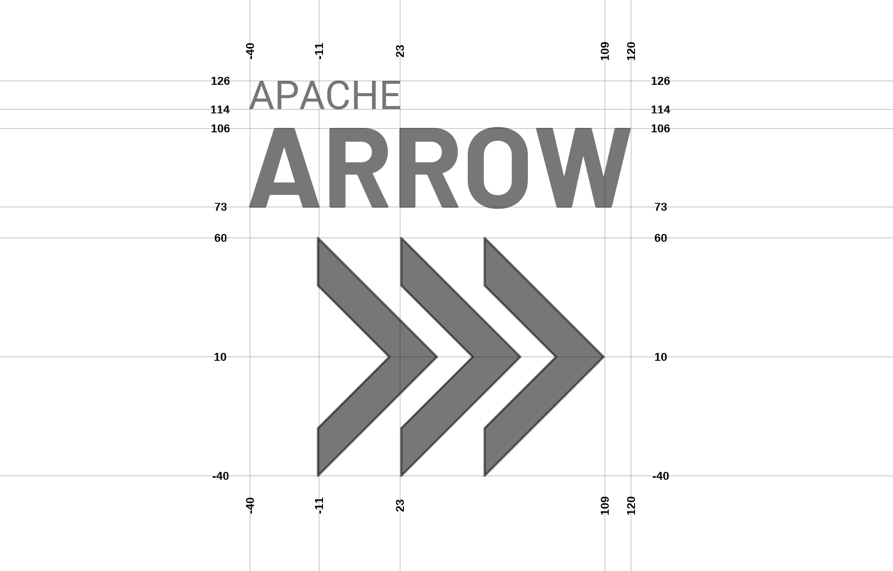

# Visual identity guidelines for Apache Arrow

> WARNING: THIS IS A DRAFT PROPOSAL ONLY. DO NOT CITE OR RELY ON THIS VERSION

As a community project, the visual identity guidelines for Apache Arrow attempt to balance the need to maintain consistent visual imagery in "formal" contexts, while allowing flexibility for fun and creative reuse of the Apache Arrow visual identity in "informal" contexts! 

## Structure of the logo

The Apache Arrow logo consists of the "Apache Arrow" logotype and the "Triple Chevron" logomark, usually arranged horizontally with the text placed to the left of the image. The standard "light theme" version of the logo uses black text and image against a white background, and the standard "dark theme" version of the logo is white against a black background.

The word "Apache" in the logotype is written in all caps Roboto font, and the word "Arrow" is wrotten in all caps "Barlow" font in boldface. Both should use normal font kerning. The precise fontsize may depend slightly on the display context but the intent is that the word "Arrow" be approximately 3 times the height, and approximately 2.5 times the width of the word "Apache". The text should be left-justified, with the leftmost edge of the first letters in both words aligned horizontally. Both fonts are freely available: Roboto is licenced under the Apache licence, Barlow under the SIL Open Font Licence, and both are accessible through Google Fonts. 

The annotated image below shows the precise spacing used in the horizontal version of the Apache Arrow logo as well as the design of the Triple Chevron. Each chevron has width exactly half its height, and forms a 90-degree angle at the tip. The thickness (both vertically and horizontally) of the chevron is 20% of its height. The spacing between adjacent chevrons is 15% of the height (i.e., if height = 100, width = 50, and spacing = 15). 

The horizontal midline of the word "Arrow" is aligned with horizontal midline of the chevrons, and the height of the word "Arrow" is approximately 1/3 the total height of the chevrons. Similarly the midline of the word "Apache" is aligned with the upper-inner vertex of the chevrons. The logotype and logomark are placed flush against one another, with the rightmost tip of the "W" in "Arrow" vertically aligned with the leftmost edge of the chevrons.

When horizontal space is at a premium, the vertical layout may be a better idea. As much as possible, the vertical variant attempts to preserve the same look and feel as the horizontal version, and keeps as many of the same spatial alignments (e.g., the tip of the W aligns with the chevrons in both version)

The layout of the hex sticker is almost identical to the vertical layout. There is a slight offset between the "Apache Arrow" logotype and the "chevron" logomark, in order to better accomodate the space constraints imposed by hexagonal canvas:

