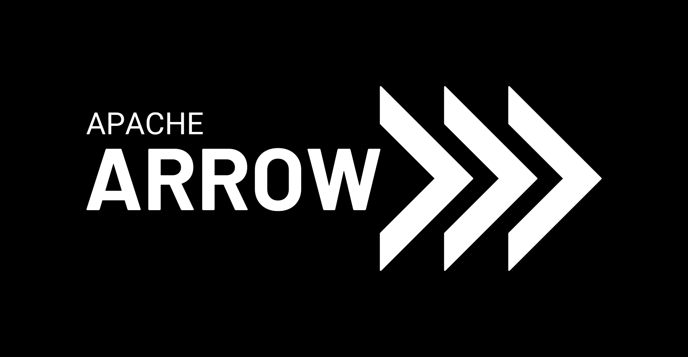
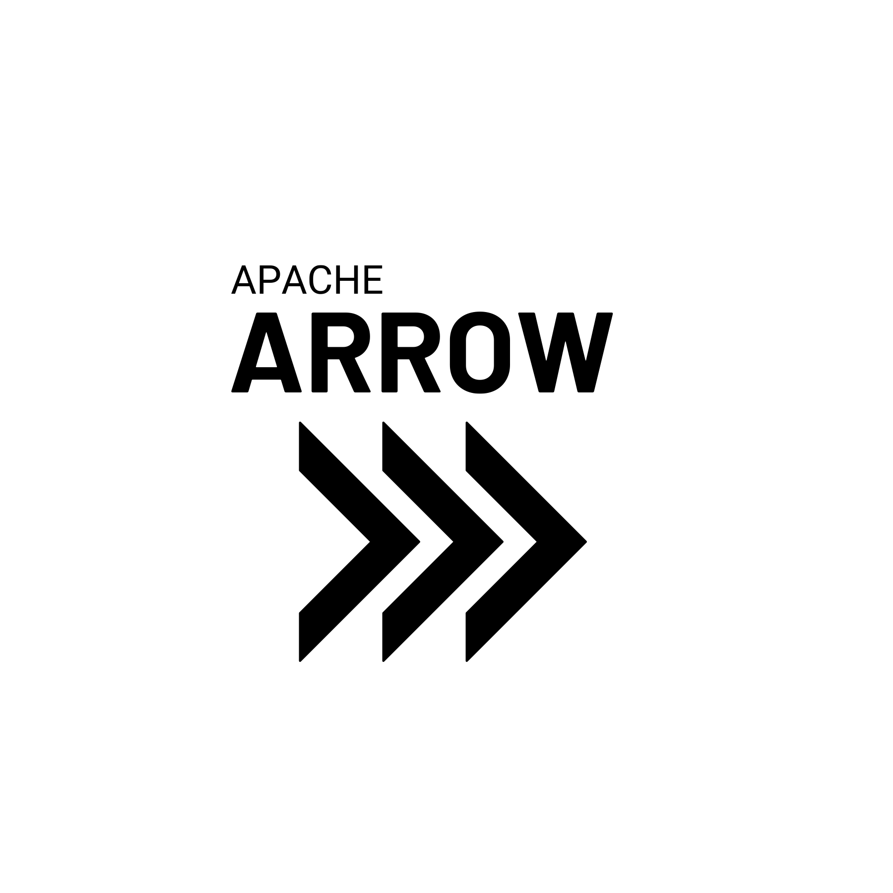
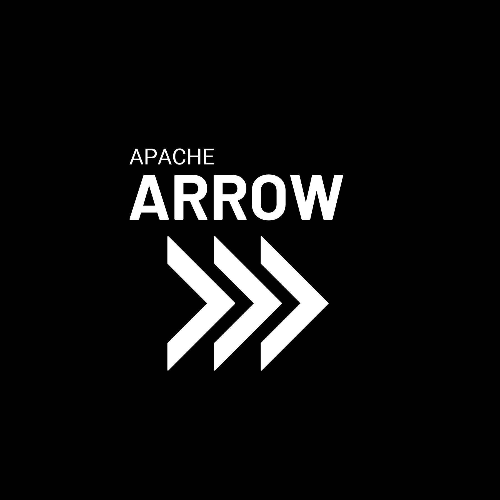

# Visual identity for Apache Arrow

> WARNING: THIS IS A DRAFT PROPOSAL ONLY. DO NOT CITE OR RELY ON THIS VERSION

As a community project, the visual identity guidelines for Apache Arrow attempt to balance the need to maintain consistent visual imagery in formal contexts, while allowing flexibility for fun and creative reuse of the Apache Arrow visual identity informal contexts! 

## Structure of the logo

The Apache Arrow logo consists of the "Apache Arrow" logotype and the "Triple Chevron" logomark, arranged horizontally with the text placed to the left of the image. The standard "light theme" version of the logo uses black text and image against a white background, and the standard "dark theme" version of the logo is white against a black background.

The word "Apache" in the logotype is written in all caps Roboto font, and the word "Arrow" is written in all caps "Barlow" font in boldface. Both should use normal font kerning. The precise fontsize may depend slightly on the display context but the intent is that the word "Arrow" be approximately 3 times the height, and approximately 2.5 times the width of the word "Apache". The text should be left-justified, with the leftmost edge of the first letters in both words aligned horizontally. Both fonts are freely available: Roboto is licenced under the Apache licence, Barlow under the SIL Open Font Licence, and both are accessible through Google Fonts. 

The annotated image below shows the precise spacing used in the horizontal version of the Apache Arrow logo as well as the design of the Triple Chevron. Each chevron has width exactly half its height, and forms a 90-degree angle at the tip. The thickness (both vertically and horizontally) of the chevron is 20% of its height. The spacing between adjacent chevrons is 15% of the height (i.e., if height = 100, width = 50, and spacing = 15). 

The horizontal midline of the word "Arrow" is aligned with horizontal midline of the chevrons, and the height of the word "Arrow" is approximately 1/3 the total height of the chevrons. Similarly the midline of the word "Apache" is aligned with the upper-inner vertex of the chevrons. The logotype and logomark are placed flush against one another, with the rightmost tip of the "W" in "Arrow" vertically aligned with the leftmost edge of the chevrons.

The horizontal layout above is the preferred variant of the Apache Arrow logo, but there will be cases where the full logo doesn't fit. There will be situations where using the "Apache Arrow" logotype alone or the "Triple Chevron" logomark alone is the most appropriate thing to do: the expectation is that people use their best judgment.

In addition to the partial (logomark-only and logotype-only) layouts, there may be cases where a vertical layout work best. The vertically oriented logo attempts to preserve the same look and feel as the horizontal version, and preserves some points of horizontal alignment between components of the logotype and logomarks:

A good example of when the vertical layout is more appropriate is in the context of hex stickers. The standard version of the hex sticker arranges the vertical within a hexagonal frame so that it has some alignment with the native symmetries of the hexagon shape:

## Official variations

The light theme and dark theme versions of the Apache Arrow logo are simple inversions of one another. The light theme uses black text against a white (or other light coloured) background:

Similarly, the dark theme uses white text against a black (or other dark coloured) background:

The image files in this repository include both variants, and include versions with transparent backgrounds as well as opaque backgrounds. It is entirely acceptable to use the transparent background variants against backgrounds that aren't precisely white or black (what would be the point otherwise?) --- in fact this usage is illustrated on the official [Apache Arrow website](https://arrow.apache.org/) which employs the transparent version of the logo to place  white text over a grey background!

Horizontal and vertical versions of all variants are included:

&nbsp;&nbsp;

Similarly, two official variations of the hex sticker are provided:

&nbsp;&nbsp;

The repository also includes separate files for "Triple Chevron" logomark without any accompanying text:

&nbsp;&nbsp;

There are also files for the "Apache Arrow" logotype without the logomark:

&nbsp;&nbsp;

## Official usage guidelines

Usage guidelines for official logos are quite similar across many brands, and the typical rules apply for the Apache Arrow logo

 - Please don't visually distort the logos
 - Please reproduce at a clearly visible resolution 
 - Please don't modify the text or the design of the chevrons
 - Please don't add additional text to the logotype or imagery to the chevrons
 
In general, the principles laid out in [Apache Foundation Style Guide](https://apache.org/foundation/press/kit/ApacheFoundation_StyleGuide.pdf) for usage of the Apache logo are also appropriate for the Apache Arrow logo

## Creating unofficial images

Okay that was the boring part, and we had to include it because Apache Arrow is a large project and it genuinely does need to have some meaningful visual identity. If you're in a situation where you want to refer formally to the Apache Arrow project you should adhere to those guidelines pretty closely. 

That said, not everything in life is official. The purpose of the visual identity guidelines is to provide guidance on what to do when you *do* need to refer to Apache Arrow in an official or formal way. It's not meant to prevent people from having fun creating unofficial images when appropriate! 

Two fun examples that arose during the process of writing this document: on the left, a hypothetical hex sticker for an R-Ladies Arrow event; on the right, something that adds a splash of orange to the dark hex sticker

&nbsp;&nbsp;

Neither one is an official part of the Apache Arrow visual identity but totally fine for many everyday situations!

