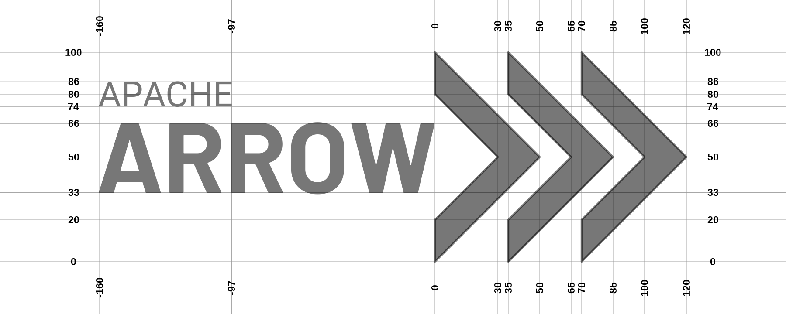

# Formal visual identity guidelines

The default layout is horizontal. The annotated logo below highlights how the different elements of the Arrow logo are laid out in relation to one another in the horizontal format

When horizontal space is at a premium, the vertical layout may be a better idea. As much as possible, the vertical variant attempts to preserve the same look and feel as the horizontal version, and keeps as many of the same spatial alignments (e.g., the tip of the W aligns with the chevrons in both version)

The layout of the hex sticker is almost identical to the vertical layout. There is a slight offset between the "Apache Arrow" logotype and the "chevron" logomark, in order to better accomodate the space constraints imposed by hexagonal canvas:

